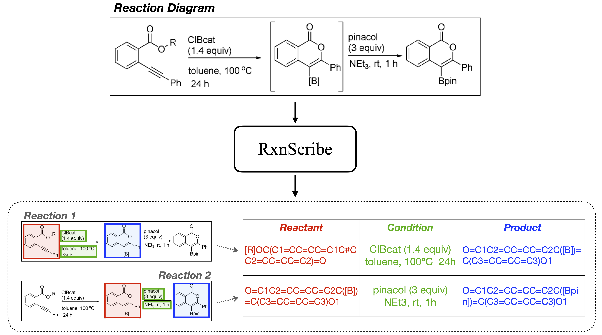

# RxnScribe 

This is the repository for RxnScribe, a sequence generation model for reaction diagram parsing.
Try our [demo](https://huggingface.co/spaces/yujieq/RxnScribe) on Hugging Face!



## Quick Start
Run the following command to install the package and its dependencies:
```
git clone git@github.com:thomas0809/RxnScribe.git
cd RxnScribe
python setup.py install
```

Download the checkpoint and use RxnScribe to extract reactions from a diagram:
```python
import torch
from rxnscribe import RxnScribe
from huggingface_hub import hf_hub_download

ckpt_path = hf_hub_download("yujieq/RxnScribe", "pix2seq_reaction_full.ckpt")
model = RxnScribe(ckpt_path, device=torch.device('cpu'))

image_file = "assets/jacs.5b12989-Table-c3.png"
predictions = model.predict_image_file(image_file, molscribe=True, ocr=True)
```
The predictions will be in the following format:
```python
[
    {  # First reaction
        'reactants': [
            {
                'category': '[Mol]', 'category_id': 1, 'bbox': (0.1550, 0.0246, 0.2851, 0.2614),
                'smiles': '*OC(=O)c1ccccc1C#Cc1ccccc1', 'molfile': '(omitted)' 
            }, 
            # ... more reactants 
        ],
        'conditions': [
            {
                'category': '[Txt]', 'category_id': 2, 'bbox': (0.2941, 0.0641, 0.3811, 0.1450),
                'text': ['CIBcat', '(1.4 equiv)']
            }, 
            # ... more conditions
        ],
        'products': [ 
            # ...
        ]
    },
    # More reactions
]
```
We provide a function to visualize the prediction:
```python
visualize_images = model.draw_predictions(predictions, image_file=image_file)
```
Each predicted reaction will be visualized in a separate image, where 
<b style="color:red">red boxes are <i><u style="color:red">reactants</u></i>,</b>
<b style="color:green">green boxes are <i><u style="color:green">reaction conditions</u></i>,</b>
<b style="color:blue">blue boxes are <i><u style="color:blue">products</u></i>.</b>

  

This [notebook](notebook/predict.ipynb) shows how to run RxnScribe and visualize the prediction.

For development or reproducing the experiments, follow the instructions below.

## Requirements
Install the required packages
```
pip install -r requirements.txt
```

## Data
Download the reaction diagrams from this [link](https://huggingface.co/yujieq/RxnScribe/blob/main/images.zip), 
and save them to `data/parse/images/`.

The ground truth files can be found at [`data/parse/splits/`](data/parse/splits/).

We perform five-fold cross validation in our experiments. The train/dev/test split for each fold is available.

This [notebook](notebook/visualize_data.ipynb) shows how to visualize the diagram and the ground truth.

## Train and Evaluate RxnScribe
Run this script to train and evaluate RxnScribe with five-fold cross validation.
```bash
bash scripts/train_pix2seq_cv.sh
```
Finally, we train RxnScribe with 90% of the dataset, and use the remaining 10% as the dev set. 
We release this [model checkpoint](https://huggingface.co/yujieq/RxnScribe/blob/main/pix2seq_reaction_full.ckpt) 
as it is trained on more data.
```bash
bash scripts/train_pix2seq_full.sh
```
